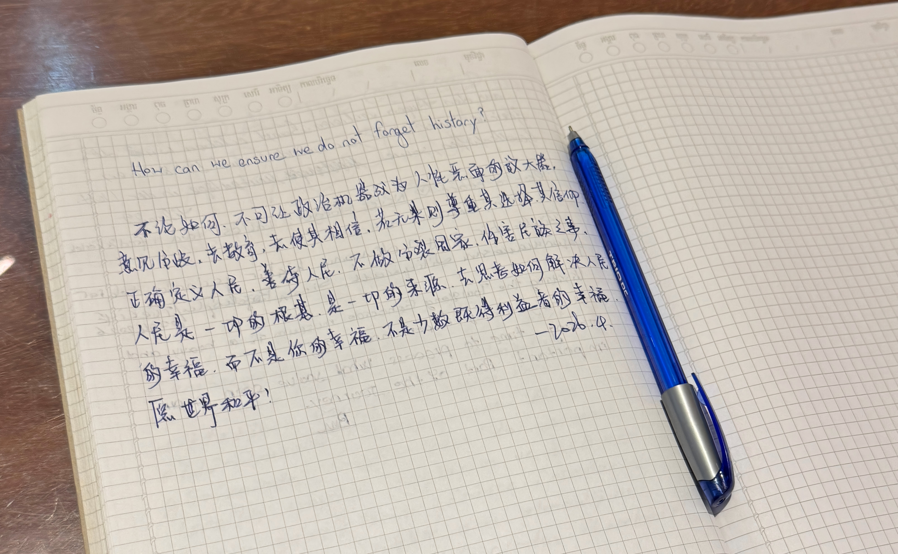

>总觉得要写下点什么才能留住这次旅行，也就有了这篇游记。

去东南亚，特别是柬埔寨真的是经过了剧烈的心理挣扎，而这种挣扎在海关提醒危险时达到了巅峰，而当你真正踏上那片土地开始行走时反而会理解这片土地上同样生活的是鲜活的人，是每一个平行时空的你（当然，注意安全、防范危险和远离中国人仍然是第一准则）。

柬埔寨之行中暹粒的时间较长，金边的时间更短。暹粒是柬埔寨旅游业的根基，因此更安全更舒适也更割裂，他像是柬埔寨这个沙漠中的一片绿洲，专门为国家名片——吴哥窟打造的一个明星城市。不论是市景、安全还是包括酒店饮食SPA在内的服务业，都是性价比顶级的水准。多数酒店都配备了泳池，且环境不错，白人游客比例很高。4月是柬埔寨的旱季，阳光直射下的暹粒是极其炎热的，而四处喷涌的的摩托尾气以及疾驶后扬起的沙尘让日间城市道路的通行变得折磨不堪，但是远离市区进入吴哥区域，大量的热带树阴带来了清爽的呼吸，较大程度上削弱了阳光的灼烧感，驾驶摩托车驰骋在遗迹间的道路上，绝对是难以忘怀的记忆。

关于吴哥遗迹，在飞机上草草观看了两部纪录片，便带着一知半解进入吴哥，根据仅有的知识拼凑，慢慢从建筑痕迹中感受吴哥的历史兴衰，不禁感叹文明兴衰的历史趋势，以及教员理想的伟大。当五点从大道慢慢走向晕染橘红天空的小吴哥时，这种自然与人为的浑然天成，让我当下真的怀疑自己眼见的是否是真实，仿佛脚下是通往天堂的道路。而后太阳升起的时刻却又反而淡然失色了许多，建议从金边出发的朋友可以直接乘坐夜间大巴五点到达，直接去感受日出前的吴哥，那必然是震撼的。后续就是吴哥的小圈、大圈和外圈，样式相似，但废墟中遒劲有力的巨大树干和静谧又充满神秘色彩的建筑还是无比动容的。

从暹粒回到金边，这时又让我开始有了安全方面的顾虑，我不再随意用手机记录，索性也没有遭遇所谓的飞车党和绑架诈骗，所以对金边的安全性我难以过多描述。金边令人印象最深的莫过于吐司廉集中营，一所高中在红色高棉时期成为了进行非人道政治运动的集中营是极其令人讽刺的。当时产生的思考写在了某幢顶楼的一本册子里（署的是——2026.4），有缘的朋友或许能看到。
而后越南的旅游体验也是不错的，灯红酒绿，沙滩度假，出海，游泳，浮潜，美食等等，都是东南亚旅行的标配。

这次旅行是生动的也是惊喜的，体验比想象的要好很多，大部分遇到的人都是善意的，总感觉自己反而是用淡淡的恶意面对他人，哈哈哈哈。